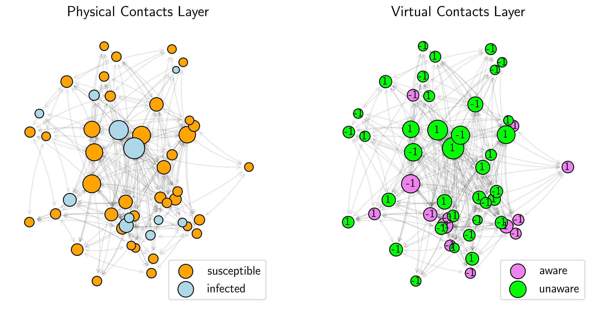
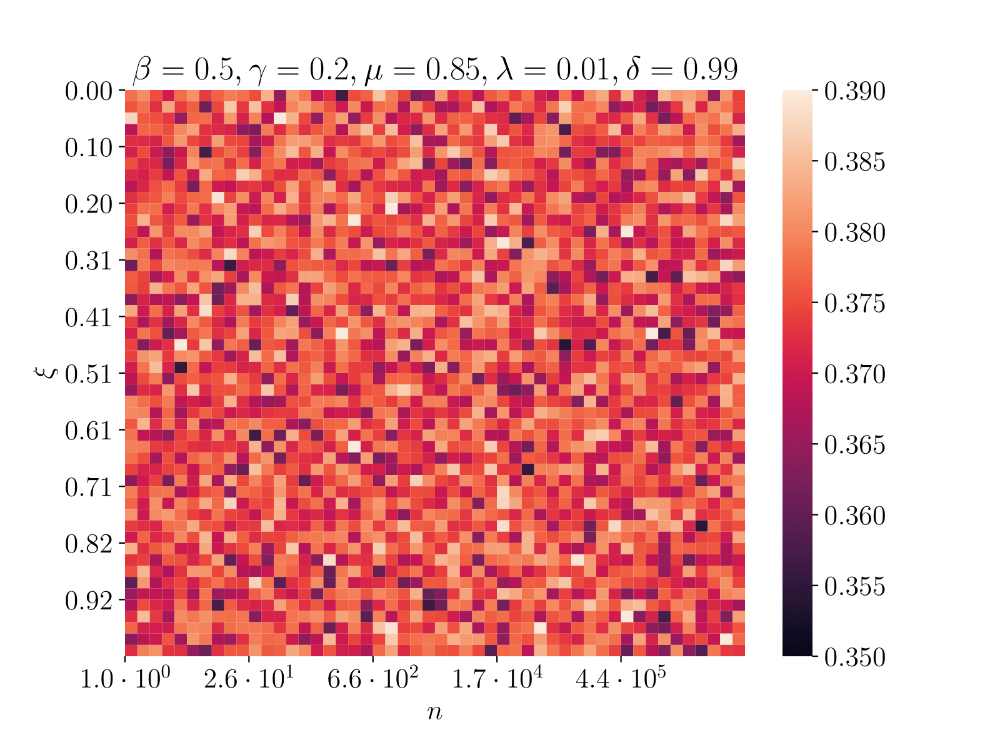
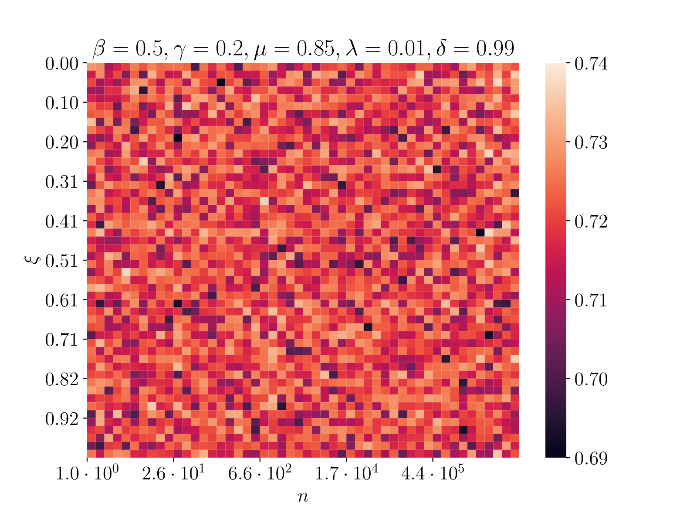

# social-media-influence-on-covid-pandemic

Simulation of the COVID pandemic on the bilayer network and study the influence of social media on behaviors of
individuals.

|  |
|----------------------------------|
|The figure presents the bilayer network which was used in experiments. It shows the initial states in the physical contacts layer (left) and the virtual contacts layer (right). For more details read the below descriptions.| 

The project aims to scrutinize the influence of social media on the global pandemic, COVID-19. It leverages methods from
complex networks to describe how awareness of the agents enlists the total dead ratio and infected ratio. The
simulations were performed on the duplex network:

- (1a) virtual contacts layer
- (1b) social media layer
- (2) physical contacts layer

**Ad (1a)**  In the virtual contacts layer each agent can be in two states: A (aware), U (unaware). If an agent is in
the A state, he knows about the epidemic. This layer has two parameters:

- \lambda -- the probability that the agent will be acknowledged about the epidemic.
- \delta -- the probability that the agent will forget about the epidemic.

Moreover, the agent has an opinion about the epidemic safety rules (+1 or -1). For instance, opinion +1 means a positive
attitude towards e.g. quarantine and vaccination. As the result, the rules of the q-voter model are also simulating. The
figure below depicts the update algorithm for the randomly selected agent.

**Ad (1b)** Every `n` steps all agents can become aware of the epidemic with the probability \xi due to the social
media.

**Ad (2).** In the physical contacts layer, each agent can be in 5 states: S (susceptible), I (infected), Q (
quarantined), R (recovered), D (dead). Parameters:

- \beta -- infection probability
- \gamma -- the probability of going into quarantine
- \mu -- recovery probability
- \kappa -- death probability

Moreover, each agent has the age and the gender, which influence on epidemic parameters.

- age -- based on _COVID-19 Hospitalization and Death by age_ [3]
- gender -- based on raport _Age, gender, and territory of COVID-19 infections and fatalities_ [4]

### Simulation parameters:

- number of agents N = 100
- number of additional links in the virtual contact layer E = 200
- number of simulation steps N_STEPS = 20000
- the percent of infected agents: 5%
- the percent of aware agents: 5%
- the person coefficient between layers: r ~= 0.97

## Experiments

### Experiment A

**How the size of the lobby in the q-voter model and the probability of independence alter the toll of deaths?**

| | 
|:----:|:----:|
| Dead ratio | Infected ratio |

The results indicate a slight correlation between parameters of the q-voter model and the toll of deaths. 
Having increased the probability of agents to act independently, the dead ratio diminishes to some degree.
On the other hand, neither `q` nor `p` affects the maximum of the infected agents in simulation, which draws interesting conclusions. 
Even though the numbers of infected agents are similar, the dead ratio is disparate.

What's more, modifying the physical contacts layer's parameters leads to completely uncorrelated behavior both for dead and infected ratio. 

### Experiment B

**To what extent the social media makes an impact on the infected and dead ratio?**

| | 
|:----:|:----:|
| Dead ratio | Infected ratio |

The results indicate no relation between the social media parameters 
and the toll of deaths and also the maximum number of infected agents. 

To conclude, the mere agent's awareness does not have such an impact compared to the previous experiment.

#### Bibliography

[1] Granell, C., Gómez, S., & Arenas, A. (2013). _Dynamical Interplay between Awareness and Epidemic Spreading in Multiplex Networks_. Physical Review Letters, 111(12). doi:10.1103/physrevlett.111.128701

[2] Granell C, Gómez S, Arenas A. _Competing spreading processes on multiplex networks: awareness and epidemics_. Phys Rev E Stat Nonlin Soft Matter Phys. 2014 Jul;90(1):012808. doi: 10.1103/PhysRevE.90.012808

[3] https://www.cdc.gov/coronavirus/2019-ncov/covid-data/investigations-discovery/hospitalization-death-by-age.html

[4] https://publications.jrc.ec.europa.eu/repository/bitstream/JRC120680/gender_territory_covid19_online.pdf